# CLAUDE.md

本文件为 Claude Code (claude.ai/code) 在此代码库中工作时提供指引。

## 变更记录 (Changelog)

### 2025-10-21 10:56:05
- 完成全仓架构扫描与文档初始化
- 新增模块化架构图（Mermaid）
- 为 6 个主模块生成详细文档
- 覆盖率：核心模块 100%，示例代码已记录

---

## 项目愿景

On_chain 是一个跨平台的 Dart/Flutter 区块链开发包，旨在为开发者提供统一、高效的多链开发体验。项目支持 Ethereum、Tron、Solana 和 Filecoin 四大主流区块链网络，并提供完整的交易创建、智能合约交互、签名和 RPC 通信能力。

**核心价值**：
- 统一的 API 设计模式，降低多链开发学习曲线
- 类型安全的 Dart 实现，减少运行时错误
- 完整的 HD 钱包支持，符合 BIP32/39/44 标准
- 丰富的预构建指令和合约模板

---

## 架构总览

### 模块结构图

```mermaid
graph TD
    Root["(根) On_chain 跨链开发包"] --> Ethereum["ethereum/"];
    Root --> Tron["tron/"];
    Root --> Solana["solana/"];
    Root --> Filecoin["filecoin/"];
    Root --> Solidity["solidity/"];
    Root --> BCS["bcs/"];
    Root --> Utils["utils/"];

    Ethereum --> EthAddress["地址管理"];
    Ethereum --> EthKeys["密钥管理"];
    Ethereum --> EthTx["交易处理"];
    Ethereum --> EthRPC["RPC 通信"];

    Tron --> TronAddress["地址管理"];
    Tron --> TronProtobuf["Protobuf 序列化"];
    Tron --> TronProvider["Provider 层"];

    Solana --> SolAddress["地址管理"];
    Solana --> SolInstructions["预构建指令"];
    Solana --> SolRPC["RPC 客户端"];

    Filecoin --> FilAddress["多类型地址"];
    Filecoin --> FilSigner["签名器"];
    Filecoin --> FilProvider["Provider 层"];

    Solidity --> ABI["ABI 编解码"];
    Solidity --> Contract["合约交互"];
    Solidity --> EIP712["EIP712 签名"];

    BCS --> Serialization["BCS 序列化"];
    BCS --> Move["Move 类型"];

    click Ethereum "./lib/ethereum/CLAUDE.md" "查看 Ethereum 模块文档"
    click Tron "./lib/tron/CLAUDE.md" "查看 Tron 模块文档"
    click Solana "./lib/solana/CLAUDE.md" "查看 Solana 模块文档"
    click Filecoin "./lib/filecoin/CLAUDE.md" "查看 Filecoin 模块文档"
    click Solidity "./lib/solidity/CLAUDE.md" "查看 Solidity 模块文档"
    click BCS "./lib/bcs/CLAUDE.md" "查看 BCS 模块文档"
    click Utils "./lib/utils/CLAUDE.md" "查看 Utils 模块文档"
```



### 架构原则

1. **按区块链网络分层**：每个网络独立成模块，互不干扰
2. **统一的 RPC 模式**：所有网络遵循 Service → Provider → Request 三层架构
3. **共享基础设施**：密码学原语由 `blockchain_utils` 包提供
4. **类型驱动开发**：充分利用 Dart 类型系统保证安全性

---

## 模块索引

| 模块 | 路径 | 职责 | 入口文件 | 测试目录 |
|------|------|------|----------|----------|
| **Ethereum** | `lib/ethereum/` | Ethereum 网络支持（Legacy, EIP1559, EIP2930, EIP712, EIP4361） | `ethereum.dart` | `test/ethereum/` |
| **Tron** | `lib/tron/` | Tron 网络支持，Protobuf 序列化 | `tron.dart` | `test/tron/` |
| **Solana** | `lib/solana/` | Solana 网络支持，Borsh 序列化，Metaplex 集成 | `solana.dart` | 无独立测试 |
| **Filecoin** | `lib/filecoin/` | Filecoin 网络支持，多类型地址系统 | `filecoin.dart` | `test/filecoin/` |
| **Solidity** | `lib/solidity/` | Solidity ABI 编解码，合约交互，EIP712 | `solidity.dart` | 无独立测试 |
| **BCS** | `lib/bcs/` | Binary Canonical Serialization，Move 语言支持 | `serialization.dart` | `test/move/` |
| **Utils** | `lib/utils/` | 跨模块共享工具（数字处理、Map 操作） | `utils.dart` | 无独立测试 |

---

## 运行与开发

### 环境要求

- Dart SDK: `>=3.3.0 <4.0.0`
- 核心依赖: `blockchain_utils: ^5.2.0`（提供密码学原语）

### 常用命令

```bash
# 获取依赖
dart pub get

# 运行所有测试
dart test

# 运行特定网络测试
dart test test/ethereum/
dart test test/tron/
dart test test/filecoin/
dart test test/move/

# 代码分析
dart analyze

# 代码格式化
dart format .
```

### 示例代码

项目在 `example/lib/example/` 提供了丰富的示例：
- HD 钱包生成：`ethereum/hd_wallet.dart`, `tron/hd_wallet_example.dart`, `solana/hd_wallet_example.dart`
- 合约调用：`contract/call_example.dart`, `contract/call_with_fragment_example.dart`
- EIP712 签名：`eip_712/v4_example.dart`, `eip_712/legacy_example.dart`
- Filecoin 操作：`filecoin/filecoin_example.dart`, `filecoin/testnet_example.dart`

---

## 测试策略

### 测试组织

- **单元测试**：覆盖密钥生成、地址验证、交易序列化、ABI 编解码
- **签名验证测试**：验证交易签名的正确性和互操作性
- **示例代码**：`example/` 目录下的代码用于展示功能，非自动化测试

### 测试文件分布

```
test/
├── ethereum/          # Ethereum 测试
│   ├── transaction_test.dart
│   ├── sign_test.dart
│   ├── rlp_encode_decode_test.dart
│   ├── keys_test.dart
│   └── eip_4631_test.dart
├── tron/             # Tron 测试
│   ├── sign_test.dart
│   ├── serialization_test.dart
│   ├── key_address_test.dart
│   └── json_buff_serialization_test.dart
├── filecoin/         # Filecoin 测试（最完整）
│   ├── address_test.dart
│   ├── transaction_test.dart
│   ├── signer_test.dart
│   ├── multisig_test.dart
│   └── ...（共 10 个测试文件）
└── move/             # BCS/Move 测试
    └── move_test.dart
```

---

## 编码规范

### Dart 风格指南

- 遵循 `lints: ^6.0.0` 和 `flutter_lints: ^6.0.0` 规则
- 类名使用大驼峰（PascalCase），函数和变量使用小驼峰（camelCase）
- 优先使用 `final` 和 `const`，避免可变状态
- 库级导出使用 `export` 指令，保持公共 API 清晰

### 模块划分原则

1. **地址 (Address)**：地址创建、验证、格式转换
2. **密钥 (Keys)**：私钥/公钥管理、HD 钱包派生
3. **交易 (Transaction)**：交易构建、序列化、签名
4. **RPC/Provider**：与区块链节点通信
5. **模型 (Models)**：数据结构定义
6. **异常 (Exception)**：模块特定的异常类型

### 命名约定

- Ethereum 相关类前缀：`ETH` (例：`ETHAddress`, `ETHTransactionBuilder`)
- Tron 相关类前缀：`Tron` 或无前缀 (例：`TronAddress`, `TransferContract`)
- Solana 相关类前缀：`Sol` 或无前缀 (例：`SolAddress`, `VersionedTransaction`)
- Filecoin 相关类前缀：`Fil` (例：`FilAddress`, `FilSigner`)

---

## AI 使用指引

### 工作流建议

1. **查询架构**：先阅读本文档和对应模块的 `CLAUDE.md`
2. **定位文件**：使用模块索引表快速找到关键文件路径
3. **理解模式**：每个网络的 Address → Keys → Transaction → RPC 模式一致
4. **参考示例**：`example/` 目录提供了最佳实践参考
5. **运行测试**：修改后务必运行相关测试验证

### 常见任务

| 任务 | 参考路径 |
|------|----------|
| 添加新的 RPC 方法 | `lib/{network}/src/rpc/methds/` 或 `lib/{network}/src/provider/methods/` |
| 扩展交易类型 | `lib/{network}/src/transaction/` 或 `lib/{network}/src/models/contract/` |
| 新增 Solana 指令 | `lib/solana/src/instructions/{program_name}/` |
| 修改地址格式 | `lib/{network}/src/address/` |
| 添加 ABI 类型 | `lib/solidity/abi/types/` |

### 调试技巧

- **序列化问题**：检查对应的编码器（RLP、Protobuf、Borsh、CBOR）
- **签名失败**：验证密钥格式和哈希算法（Keccak256、SHA256、Blake2b）
- **RPC 错误**：检查 `methods/` 下的请求参数类型
- **地址无效**：确认网络特定的编码方式（Base58、Base58Check、Bech32）

---

## 关键技术细节

### Ethereum

- **交易类型**：Legacy (RLP), EIP1559 (Base Fee + Priority Fee), EIP2930 (Access List)
- **签名**：ECDSA (secp256k1)，支持 EIP155 防重放攻击
- **ABI 编码**：遵循 Solidity ABI 规范，支持 tuples、arrays、动态类型
- **EIP712**：结构化数据签名，支持 v1、v3、v4 版本

### Tron

- **序列化**：Google Protobuf
- **地址**：Base58Check 编码，兼容 Ethereum 风格的私钥
- **多签**：通过 `AccountPermissionUpdate` 合约实现
- **合约类型**：包括 Transfer、TriggerSmartContract、FreezeBalance 等 20+ 种原生合约

### Solana

- **交易**：Versioned Transaction，支持 Address Lookup Tables
- **指令**：预构建 20+ 个程序指令（System, SPL Token, Metaplex 等）
- **序列化**：Borsh (Binary Object Representation Serializer for Hashing)
- **自定义程序**：通过 `ProgramLayout` 基类扩展

### Filecoin

- **地址类型**：f0 (ID), f1 (SECP256K1), f4 (Delegated/Ethereum-compatible)
- **序列化**：CBOR (Concise Binary Object Representation)
- **签名**：SECP256K1 或 BLS (取决于地址类型)
- **RPC 方法**：支持 Chain、Eth (兼容层)、Multisig 三类方法

---

## 文件路径速查

### 核心入口文件

- 总入口：`/home/mrpzx/git/flutter/wallet/On_chain/lib/on_chain.dart`
- Ethereum：`/home/mrpzx/git/flutter/wallet/On_chain/lib/ethereum/ethereum.dart`
- Tron：`/home/mrpzx/git/flutter/wallet/On_chain/lib/tron/tron.dart`
- Solana：`/home/mrpzx/git/flutter/wallet/On_chain/lib/solana/solana.dart`
- Filecoin：`/home/mrpzx/git/flutter/wallet/On_chain/lib/filecoin/filecoin.dart`
- Solidity：`/home/mrpzx/git/flutter/wallet/On_chain/lib/solidity/solidity.dart`
- BCS：`/home/mrpzx/git/flutter/wallet/On_chain/lib/bcs/serialization.dart`

### 配置文件

- 包配置：`/home/mrpzx/git/flutter/wallet/On_chain/pubspec.yaml`
- 代码分析：`/home/mrpzx/git/flutter/wallet/On_chain/analysis_options.yaml`
- Git 忽略：`/home/mrpzx/git/flutter/wallet/On_chain/.gitignore`

---

## 下一步建议

当前扫描已覆盖核心模块，但以下方面可进一步深化：

1. **Solana 指令细节**：`lib/solana/src/instructions/` 下有 20+ 个子程序，可为重要程序（如 Metaplex）生成独立文档
2. **Tron 合约类型**：`lib/tron/src/models/contract/` 包含大量合约定义，可按功能分类文档化
3. **测试覆盖补充**：Solana 和 Solidity 模块缺少独立测试目录，建议补充测试用例
4. **示例代码索引**：`example/` 目录下有大量示例，可生成示例索引表

---

*此文档由 AI 架构师于 2025-10-21 10:56:05 自动生成，采用自适应扫描策略，平衡了速度与深度。*
